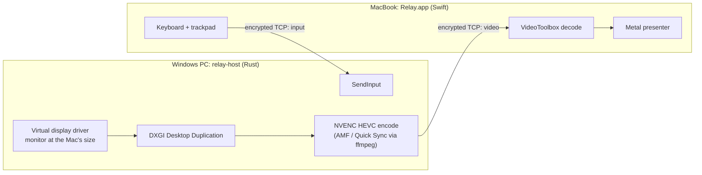

# Relay

**Use a MacBook as a 120 Hz monitor for a Windows PC, over one Ethernet cable.**

[](host/)
[](client/)
[](LICENSE)
[](https://github.com/theamanali/relay/actions/workflows/host.yml)
[](https://github.com/theamanali/relay/actions/workflows/client.yml)

<!-- Demo: docs/media/demo.gif (20–30 s): plug in the cable, pick the PC, a game running at 120 Hz on the MacBook -->

Plug the cable in, open Relay on the Mac and pick the PC. Windows gets a new
monitor at the Mac's exact native resolution, streams it to the Mac at 120 fps
with hardware HEVC, and takes the Mac's keyboard and trackpad back as input.
Disconnect, and the virtual monitor disappears and the PC's own monitors come
back as they were.

It started as a way to travel with a desktop PC and no monitor: the MacBook
already has a great 120 Hz screen. Relay is one Rust service on Windows, one
native Swift app on macOS, and a small encrypted protocol between them,
deliberately smaller than Sunshine + Moonlight: no game launcher, no settings
UI, and pairing is one PIN, once.

**Built with:** Rust · Swift · Win32 / DXGI / Direct3D 11 · NVENC · VideoToolbox ·
Metal · SwiftUI / AppKit · Network.framework · Noise · CPace · X25519 / ChaCha20-Poly1305 ·
mDNS / Bonjour · Windows services · GitHub Actions

## Highlights

- **3024×1964 at 120 fps** (a 14-inch MacBook Pro's native panel), captured and
  encoded entirely on the GPU. Stable in exclusive-fullscreen games (Valorant,
  EA Sports FC 26).
- **About 6 ms of work per frame on the PC and about 4 ms on the Mac** from
  receiving a frame to putting it on screen. Measured, not estimated; see
  [Performance](#performance).
- **End-to-end encrypted** with standard, analysed constructions: a
  `Noise_XX_25519_ChaChaPoly_SHA256` handshake and CPace, a PAKE, for the
  one-time PIN pairing. There is a [written wire spec](docs/PROTOCOL.md) and a
  shared test vector, and each side is also checked against the published
  Noise and CPace vectors.
- **No network setup.** The Mac finds the PC over Bonjour on the IPv6
  link-local addresses both machines assign the moment a cable is up, so a bare
  cable with no DHCP works. A home LAN or Tailscale works too.
- **Leaves no trace.** The virtual monitor exists only during a session. The
  PC's display layout is restored on disconnect, Ctrl-C or a killed process.

## How it works



1. **Virtual monitor.** Windows only shows monitors that come from a display
   driver, so the host drives the open-source, signed
   [MTT Virtual Display Driver](https://github.com/VirtualDrivers/Virtual-Display-Driver).
   When a Mac connects, the host snapshots the display layout, enables the
   driver's device and makes the virtual monitor the *only* display, at the
   Mac's exact pixel size and refresh rate.
2. **Capture and encode.** The virtual monitor is captured with DXGI Desktop
   Duplication and encoded by NVENC inside the same process, so frames never
   leave the GPU. AMD and Intel GPUs go through an `ffmpeg` fallback.
3. **Transport.** One TCP connection with length-prefixed, encrypted frames
   ([spec](docs/PROTOCOL.md)).
4. **Pairing.** Each side has a long-lived identity key. The first connection
   asks for the 6-digit PIN shown in the PC's tray; after that the two machines
   recognise each other by key, and every session derives fresh keys from an
   ephemeral exchange.
5. **Mac client.** VideoToolbox decodes in hardware into IOSurface-backed
   buffers, which a Metal presenter draws with no extra copy and at most one
   frame waiting. Keyboard and trackpad events go back over the same connection.

## Performance

Per frame at 3024×1964, 120 fps, HEVC, default settings, on the real hardware:

| stage | time |
|---|---|
| Capture (desktop copy, cursor, submit) | 0.2 ms |
| Encode (NVENC) | 4.3–5.9 ms |
| Encrypt + send | 0.07 ms |
| **PC total**, p50 / p95 | **5.9 / 6.5 ms** |
| Mac: received → decoded, p50 | 2.6 ms |
| **Mac: received → on screen**, mean / p95 | **4.2 / 5.3 ms** |

Mac timings start after decryption. Network transit and the panel's own response
time are not included; a camera-based screen-to-screen measurement is on the
[roadmap](#status). How these were measured, what moved them and what was
tried and rejected: **[docs/LATENCY.md](docs/LATENCY.md)**.

### Finding a hidden 0–8 ms

The host originally captured on its own fixed 120 Hz timer. Logging how old each
captured frame was showed that the timer drifted against the virtual display's
refresh: every session picked up a random 0–8 ms of extra delay and kept it, and
none of the existing latency numbers could see it. The capture loop now steers
its timer to land just after each new desktop frame:

| | average frame age at capture, per session |
|---|---|
| before | 0.7, 7.4, 5.5 and 2.6 ms (max 8.5) |
| after | 1.2 ms every session (max 1.6) |

The Mac's p95 time to screen dropped by 1.8 ms as a result. Two simpler fixes
were measured and rejected; both are written up in
[docs/LATENCY.md](docs/LATENCY.md#the-hidden-08-ms).

## Design decisions

- **TCP, not WebRTC or custom UDP.** On a dedicated cable there is no packet
  loss and no competing traffic, so jitter buffers and error correction would
  only add latency.
- **Steady capture timer, not "send each frame the moment it appears".**
  Sending on arrival was 0.7 ms faster but visibly juddered, because the virtual
  display's refresh is a software timer that jitters by milliseconds.
- **Don't wait inside the capture call.** Blocking in `AcquireNextFrame` holds
  the shared GPU device lock, which stalls the encoder for a full frame. The
  capture thread polls every 200 µs instead.
- **Switch the virtual display's device on and off rather than reconfiguring
  the driver.** The driver's own control commands crash it, and Windows gives up
  on it after five crashes. While a session runs, the PC's physical monitors are
  disabled too, so fullscreen games can't switch back to them.
- **A Windows service with a SYSTEM-level worker.** Screen capture and input
  injection only work from the active desktop, and a normal user process can't
  open the lock or login screen. Running the worker as SYSTEM in the signed-in
  session lets those screens stream and lets the service restore the PC's
  monitors if the worker crashes. (Implemented; hardware verification in
  progress.)
- **A PIN, checked with a PAKE.** The first pairing proves the PC's six-digit PIN
  with CPace inside a Noise XX channel, and the PC proves it back. Someone in
  the middle gets one guess per attempt (rate-limited) and nothing to test
  offline; after that the pinned keys make impersonation impossible on any
  network. CryptoKit has no field arithmetic, so the Mac computes the PIN's
  curve point with about 150 lines of TweetNaCl-style code, timing-tested for
  input independence (`client/Tools/ctcheck.swift`).

## Status

**Platform migration (2026-10-10):** the Mac now uses SwiftUI for the picker,
settings, PIN sheet and commands, Swift 6 language mode, and an arm64-only
bundle with a macOS 14 minimum (Observation). Metal and hardware decoding are
required. All 107 Mac unit tests, isolated fakehost checks and the signed local
release bundle pass on macOS 27.0. Windows NVIDIA enforcement and backend
removal remain assigned to the PC session; see the
[Windows handoff](docs/WINDOWS-PLATFORM-HANDOFF.md). Real-PC regression/latency,
minimum/latest-stable OS qualification and Developer ID notarization are still
pending. Older hardware streaming results below predate this UI migration.

**Working and verified on the real hardware:** the virtual monitor at the
Mac's native mode with the PC's layout restored afterwards; in-process capture
and NVENC encode at 3024×1964 @ 120 in exclusive-fullscreen games; pairing,
encryption, discovery and forgetting a pairing from either side; the Mac app
(PC picker, hardware decode, Metal presentation, keyboard and trackpad); the
Windows tray menu.

On 2026-10-09, the real Mac and PC passed protocol v4 existing/fresh pairing,
wrong-PIN rejection, Forget from either side, reconnect without a PIN, and
3024×1964@120 streaming. Normal disconnect restored physical monitors and layout.
Lock/unlock during a stream and connecting while already locked passed. One
reboot → login-screen connection → sign-in from the Mac passed; an earlier reboot
and sign-out/reconnect failed virtual-display setup until local sign-in.

The host now binds topology setup and restoration to the input desktop on a
separate thread, preserves access errors and failed-restore snapshots, and logs
desktop/session/readiness diagnostics. Windows unit tests, a read-only desktop
binding/CCD test, release build and strict clippy pass. On 2026-10-09 the user
reported one pass each for reboot-before-login, sign-out/reconnect and lock/unlock,
with no observed failure. The installed binary matches the fix. Logs confirm
normal disconnect restoration, restoration while bound to Winlogon during shutdown,
lock/unlock capture recovery and 3024×1964@120 streaming. The post-reboot connection
followed a Windows SessionLogon event, so setup before any user session exists is
not independently established by that log. Repeat runs and crash recovery remain
pending; see the
[reboot and sign-out retest sequence](host/PRELOGIN-RETEST.md).

Pair-only naming is implemented on the host and Mac, with an optional v4
capability and the name bound into CPace confirmation. An updated host learns
the Mac's name before pairing success; older hosts still pair with the new Mac
and learn its name on the first stream. See the [wire contract](docs/PROTOCOL.md)
and [Mac tests](client/README.md#testing). On 2026-10-09, all 99 Swift tests,
isolated HostConnection/fakehost loopback checks and the Mac release bundle
passed. On 2026-10-10 the user confirmed that Pair without Connect immediately
shows the Mac's name in the PC's Forget submenu.

On 2026-10-10, host commit `ae249f4` passed Windows formatting, 145 unit tests
and the probe integration test, strict clippy and release build, and was deployed
with `install-host.ps1 -SkipDriver`. The installed executable matches that build.
Against the running service, a known probe identity re-paired after a 12-second
wait, rejected a delayed wrong PIN, then paired on a delayed correct retry.
Pair-only Unicode naming and immediate UNPAIR passed without requesting a display;
the original peer list was preserved. The user then reported all five real-Mac
checks passed: delayed PIN entry, wrong-PIN retry, confirmed Forget, pair-only
naming, and ordinary Connect/disconnect with physical monitors/layout restored.
Host logs support delayed pairing, UNPAIR, the Mac name before streaming,
3024×1964@120 streaming and successful restoration. See the
[verification record](docs/KNOWN-PEER-PIN-HANDOFF.md#windows-verification-record--2026-10-10).

**Next:**

- [ ] Windows service: repeat reboot-before-login and sign-out/reconnect (one
      user-reported pass each), confirm setup before any user session exists, and
      verify crash restoration
- [ ] Confirm the real Mac's pair-only name persists after a service restart;
      immediate tray naming passed on 2026-10-10. See the
      [Mac handoff](host/PAIR-NAME-HANDOFF.md).
- [ ] Camera-based screen-to-screen latency measurement
- [ ] Display scaling (DPI) for the virtual monitor
- [ ] Signed Windows installer and notarized Mac app
- [ ] HDR end to end

## Getting started

You need a Windows 11 PC with an NVIDIA GPU (the supported target), a
Apple silicon Mac on macOS 14 or later, and an Ethernet cable (a USB-C Ethernet adapter on the
Mac is fine; no crossover cable or switch needed).

**Windows** (Rust with the MSVC toolchain), from the repo root:

```powershell
cd host; cargo build --release; cd ..
.\tools\install-host.ps1     # elevated: installs the driver, firewall rule and the Relay service
```

**Mac:**

```sh
cd client
./bundle.sh && open Relay.app
```

On the Mac, select the PC in Relay's list and choose **Pair**, enter the PIN
from the Relay tray icon on the PC, then choose **Connect**.

The full manuals, with every command-line flag, the tray menu and
troubleshooting, are [host/README.md](host/README.md) and
[client/README.md](client/README.md).

## Repository layout

| path | what |
|---|---|
| [`host/`](host/) | Windows host (Rust): virtual display control, capture and encode, Windows service and tray, protocol server |
| [`client/`](client/) | macOS client (SwiftUI, AppKit stream adapter): discovery, pairing, decode, Metal presenter, input |
| [`docs/PROTOCOL.md`](docs/PROTOCOL.md) | wire protocol spec, the contract both sides implement |
| [`docs/LATENCY.md`](docs/LATENCY.md) | how the latency was measured and tuned, including what didn't work |
| [`tools/`](tools/) | Windows installer and driver settings template |

Each side can be tested without the other machine: `host/src/bin/probe.rs` is a
fake Mac client and `client/Tools/fakehost/` is a fake PC host. Both run the
real handshake and pairing. Unit tests (145 Rust plus one opt-in Windows desktop
test and a probe integration test, 112 Swift),
including the cross-implementation test vector, the Noise cacophony vectors and
the CPace draft vectors: `cargo test` on Windows, `swift test` on macOS;
GitHub Actions runs both (plus `cargo fmt --check` and `cargo clippy -D warnings`)
on every push that touches that side.

## Known limitations

- NVIDIA is the supported Windows target. Pending the Windows migration, legacy
  AMD (AMF) and Intel (Quick Sync) paths still go through
  `ffmpeg` and are implemented but unverified, as is
  [parsec-vdd](https://github.com/nomi-san/parsec-vdd) as an alternative
  display driver.
- Built for a cable or a LAN: there is no congestion control, so it is not meant
  for streaming over the internet.
- macOS keeps ⌘Tab, ⌘Space and the Fn media keys; everything else is forwarded.
- Windows' scaling for the virtual monitor has to be set once by hand in
  Settings → Display (200% looks right at Retina resolution).

## Acknowledgements

- [MTT Virtual Display Driver](https://github.com/VirtualDrivers/Virtual-Display-Driver)
  provides the virtual monitor.
- [parsec-vdd](https://github.com/nomi-san/parsec-vdd) is the alternative driver.
- The NVENC bindings are derived from `nvidia-video-codec-sdk` 0.4.0
  (© 2023 Viliam Vadocz, MIT; notice in `host/src/nvenc_bindings/`).
- [snow](https://github.com/mcginty/snow) runs the host's Noise handshake; the
  [Noise Protocol Framework](https://noiseprotocol.org) and
  [CPace](https://datatracker.ietf.org/doc/draft-irtf-cfrg-cpace/) specs come
  with the test vectors both sides are checked against, and the field
  arithmetic follows [TweetNaCl](https://tweetnacl.cr.yp.to) (public domain).

## License

MIT; see [LICENSE](LICENSE).
